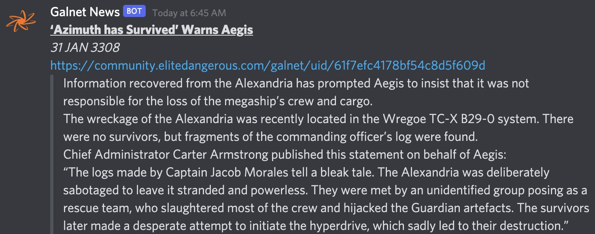

# Galnet News

[](https://hub.docker.com/repository/docker/pvillaverde/galnet_news/tags)
[](https://hub.docker.com/repository/docker/pvillaverde/galnet_news)
[](https://github.com/pvillaverde/galnet_news/actions/workflows/docker-image.yml)



Simple script to be run in a CronJob, check the newest article from Galnet News and post to the Discord Webhook URL specied in the environment variables.

> [!NOTE]
> 💡 This project is based on the original [Galnet Discord Bot](https://github.com/pluginpatch/galnet-discord-bot/tree/main) but rewritten in Deno and using WebHooks URL and a single record file instead of sqlite and a full discord bot.

<!--  https://github.com/orgs/community/discussions/16925 -->

## 🗂️ Table of Contents

- [🌈 Features](#-features)
  - [🐛 Known Bugs](#-known-bugs)
  - [🛣️ Roadmap](#️-roadmap)
- [🚀 Getting Started](#-getting-started)
  - [🧩 Requirements](#-requirements)
  - [☸️ Running it on Kubernetes](#️-running-it-on-kubernetes)
  - [🐳 Running in Docker](#-running-in-docker)
  - [🧱 Running locally](#-running-locally)
- [🙋Support &amp; Contributing](#support--contributing)
- [🏆 Credits &amp; Acknowledgements 🙏](#-credits--acknowledgements-)
- [⚖️ License](#️-license)
- [🔗 Reference links and bibliography 📚](#-reference-links-and-bibliography-)

<!-- Created by https://github.com/ekalinin/github-markdown-toc -->

## 🌈 Features

- 🌐 Available in the Galnet News Language, customizable with `LANGUAGE` env var. Possible values:
  - English (Default): `en-GB`
  - German: `de-DE`
  - French: `fr-FR`
  - Spanish: `es-ES`
  - Portuguese: `pt-BR`
  - Italian: `it-IT`
  - Dutch: `nl-NL`
  - Russian: `ru-RU`
- 🚀 Easy to setup with Docker, Kubernetes or a single cronJob. NO DISCORD BOT required.
- 🆓 100% free and open-source

### 🐛 Known Bugs

- So far, all fixed! 🥳

### 🛣️ Roadmap

- [ ] Add some unit tests.

**[⬆️ Back to Top](#galnet-news)**

## 🚀 Getting Started

### 🧩 Requirements

In order to run galnet_news you will just need a [Discord Webhook URL](https://support.discord.com/hc/en-us/articles/228383668-Intro-to-Webhooks).

### ☸️ Running it on Kubernetes

This fork was designed to be run on kubernetes as a CronJob with the following manifests that create a `PersistentVolumeClaim` to store the file with the last article id and a secret to store the webhook URL:

```yaml
kind: PersistentVolumeClaim
apiVersion: v1
metadata:
  name: pvc-galnet
  namespace: default
spec:
  accessModes:
  - ReadWriteOnce
  resources:
    requests:
      storage: 1Mi
---
apiVersion: v1
kind: Secret
metadata:
  name: galnet
  namespace: default
stringData:
  WEBHOOK_URL: https://discord.com/api/webhooks/XXXXXXXXX/XXXXXXXXXXXXXXXXXXXX
---
apiVersion: batch/v1
kind: CronJob
metadata:
  name: galnet
  namespace: default
spec:
  schedule: "*/15 * * * *"
  jobTemplate:
    spec:
      template:
        spec:
          containers:
          - name: galnet
            image: pvillaverde/galnet_news:latest
            volumeMounts:
            - name: data
              mountPath: /data
            command: ["deno"]
            args:
            - task
            - main
            env:
            - name: LANGUAGE
              value: es-ES
            - name: SAVE_PATH
              value: /data/last_record.txt
            - name: WEBHOOK_URL
              valueFrom:
                secretKeyRef:
                  name: galnet
                  key: WEBHOOK_URL
          volumes:
          - name: data
            persistentVolumeClaim:
              claimName: pvc-galnet
          restartPolicy: OnFailure
```

### 🐳 Running in Docker

You can run it manually or in a `crontab` file with the following command, passing the environment variables as needed:

```bash
docker run \
   -e LANGUAGE="es-ES" \
   -e WEBHOOK_URL="https://discord.com/api/webhooks/XXXXXXXXXXXXX/XXXXXXXXXXXXXXXX" \
   -v ./data/:/data \
   --name galnet \
   --entrypoint deno pvillaverde/galnet_news task main
```

### 🧱 Running locally

You will need to have Deno installed in your machine and the environment variables setup, then you can just run `deno task main` to fetch the API and post to discord.

**[⬆️ Back to Top](#galnet-news)**

<!-- CONTRIBUTING -->

## 🙋Support & Contributing

If you want to add any missing feature or report a bug, you [can request ir or report it here][issues-url]. Also if you are want and know how to do it, go ahead! That's what make the open source community shines, by allowing us to grow and learn from each other creating amazing tools! Any contribution you make is **greatly appreciated**.

1. Fork the Project
2. Create your Feature Branch (`git checkout -b feature/AmazingFeature`)
3. Commit your Changes (`git commit -m 'Add some AmazingFeature'`)
4. Push to the Branch (`git push origin feature/AmazingFeature`)
5. Open a Pull Request

## 🏆 Credits & Acknowledgements 🙏

- [Original Galnet News Discord Bot](https://github.com/pluginpatch/galnet-discord-bot/)

## ⚖️ License

[![GitHub license][license-shield]][license-url] - Distributed under the GNU GPL-v3 License. See [LICENSE][license-url] on for more information.

## 🔗 Reference links and bibliography 📚

- [NPM: Simple Discord WebHook](https://www.npmjs.com/package/simple-discord-webhooks)

**[⬆️ Back to Top](#galnet-news)**

<!-- MARKDOWN LINKS & IMAGES -->
<!-- https://www.markdownguide.org/basic-syntax/#reference-style-links -->

[license-shield]: https://img.shields.io/badge/license-GNU%20GPL--v3-brightgreen
[license-url]: https://github.com/pvillaverde/galnet_news/blob/main/LICENSE
[project-url]: https://github.com/pvillaverde/galnet_news
[issues-url]: https://github.com/pvillaverde/galnet_news/issues
